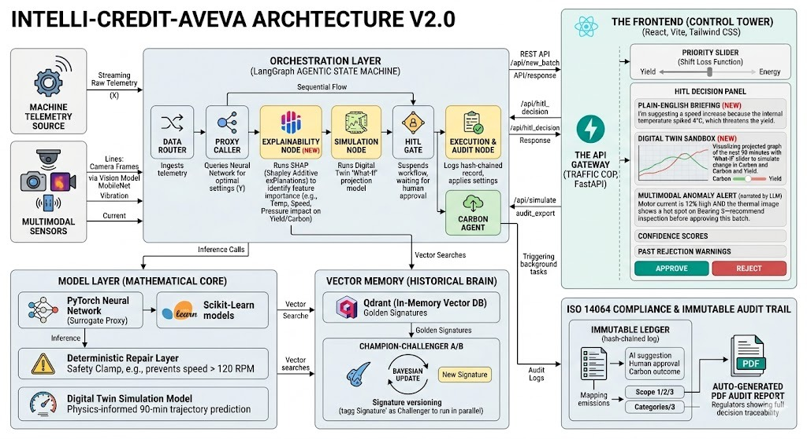

# Intelli-Credit-Aveva 🏭

> **🏆 1st Prize Winner — IITH x AVEVA Hackathon**  
> An enterprise-grade, full-stack AI platform built to solve the ultimate manufacturing dilemma: maximizing product quality and yield while strictly minimizing energy consumption and carbon emissions.

---

## 🏗️ Architecture



---

## 🏭 The Problem: Energy vs. Quality Trade-off

Imagine a massive factory producing millions of medicine tablets. The machines have hundreds of dials and settings (like temperature, pressure, rotation speed). The factory managers are playing a constant game of tug-of-war:

1. **Maximize Yield**: They want to make the best quality tablets as fast as possible.
2. **Minimize Footprint**: They want to leverage the least amount of electricity possible to hit Carbon footprint targets and save money.

Usually, cranking up the machine speed to make more tablets drastically increases power usage or produces damaged (friable) tablets. Finding the "perfect balance" given live telemetry of the factory is nearly impossible for a human to calculate in real-time.

---

## 🤖 Our Solution: The AI Supervisor

Intelli-Credit-Aveva is an **Agentic AI-driven supervisor** that finds this perfect balance automatically using a 5-layer modular architecture.

1. **It Learns from History**: Ingests massive amounts of past factory data and simulates millions of scenarios (using an XGBoost Surrogate and custom NSGA-II algorithms) to locate the absolute best machine "recipes" (Golden Signatures), where energy is lowest but quality remains high.
2. **It Operates in Real-Time**: Monitors live machines and utilizes a lightning-fast PyTorch Neural Network (with a custom Deterministic Repair Layer) to dynamically suggest new settings in `< 1ms`.
3. **It Respects Human Authority**: Before any machine dials are turned, the LangGraph-based AI Orchestrator pauses and asks an operator for approval using a strictly typed Human-In-The-Loop (HITL) React dashboard.
4. **It Learns Continuously**: Every time a new "recipe" works better than the last, it saves it via Qdrant Vector Memory. The system literally gets smarter every single batch.
5. **It Stays Compliant**: Built-in Carbon Agent and immutable Audit Ledger auto-generates compliance reports (ISO 14064 readiness) tracking AI suggestions and human approvals.

---

## 🎯 Hackathon Scope & Alignment

We tackled **Option B: Optimization Engine Track**, fulfilling all core and universal objectives outlined in the case:

- ✅ **Golden Signature Framework:** Custom engineered NSGA-II algorithm discovers Pareto-optimal settings, storing them in a Qdrant Vector database for live comparison.
- ✅ **Continuous Learning:** System automatically tracks batch outcomes and upserts new performance benchmarks.
- ✅ **Human-in-the-Loop workflows (HITL):** LangGraph state machine dynamically interrupts execution to allow human review via our API-driven React UI.
- ✅ **Multi-Target Optimization:** Intelligent proxy model inherently balances primary (Tablet Weight, Friability, Hardness) against secondary targets (Power Consumption).

---

## 📂 Project Structure

This monolithic repository is split into two primary environments:

### 1. The Backend (`/backend`)
The mathematical core and agentic orchestration layer. Powered by LangGraph, PyTorch, XGBoost, and FastAPI.
👉 [Read the detailed Technical Backend Architecture here](./backend/README.md)

### 2. The Frontend (`/frontend`)
The "Control Tower." A React + Vite dashboard displaying the current batch status, digital twin projections, and the human-operator approval gates.
👉 [Read the Frontend documentation here](./frontend/README.md)

---

## 🚀 Quick Execution Guide

For comprehensive setup, please refer to the specific folder READMEs.

### Prerequisites
- Node.js (v18+)
- Python (3.9+)

### Running the Full Stack

1. **Start the Backend Engine & Orchestration**
   Open a terminal and navigate to `/backend`:
   ```bash
   pip install -r requirements.txt
   python offline_optimizer.py
   python orchestration_layer.py
   ```
   *(Note: Use `python -X utf8` on Windows to avoid encoding issues with console output).*

2. **Start the Frontend Dashboard**
   Open a new terminal and navigate to `/frontend`:
   ```bash
   npm install
   npm run dev
   ```

---

## 📄 License
This prototype is released under the [LICENSE](LICENSE). Built with ❤️ by the winning team at IITH x AVEVA.
